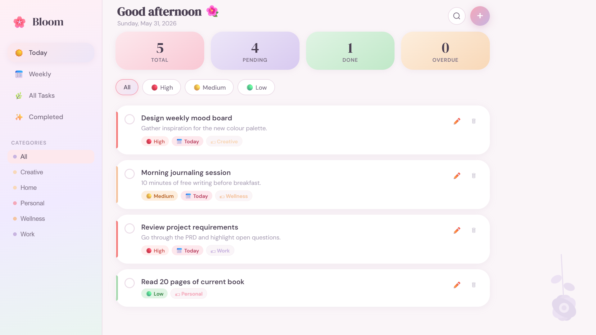
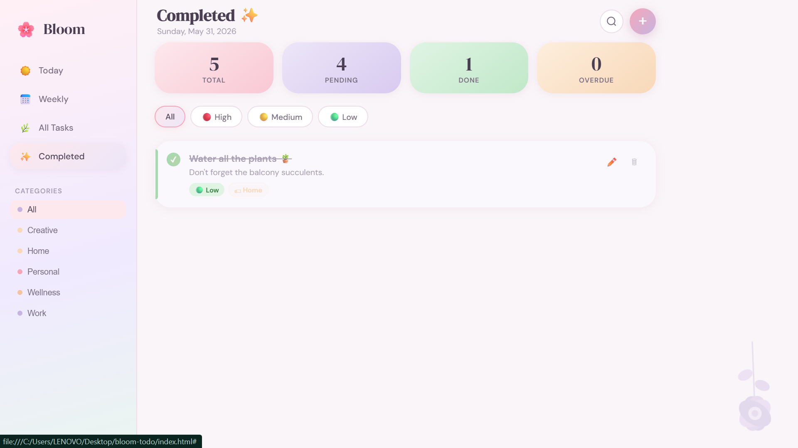

# 🌸 Bloom — Elegant Task Management App

## 🌷 Experience Bloom

🔗 https://palakverma-web.github.io/bloom-tasks/

A beautiful floral-themed task management application built with HTML, CSS, and Vanilla JavaScript. Bloom helps users organize tasks, manage priorities, track progress, and stay productive through a calm and elegant user experience.

---

## Preview

### Dashboard



### Completed Tasks


### Category & Priority Filtering



---

## Features

* Create, edit, and delete tasks
* Mark tasks as completed
* Priority management (High, Medium, Low)
* Due date tracking
* Category-based organization
* Real-time search and filtering
* Live statistics dashboard
* LocalStorage persistence
* Responsive design
* Elegant pastel-inspired UI

---

## Tech Stack

* HTML5
* CSS3
* Vanilla JavaScript
* LocalStorage API

---

## Application Views

* Today View
* Weekly View
* All Tasks View
* Completed Tasks View

---

## Project Structure

```text
bloom-tasks/
│
├── index.html
├── css/
│   └── style.css
├── js/
│   └── app.js
├── assets/
│   ├── homepage.png
│   ├── homepage1.png
│   └── homepage2.png
└── README.md
```

---

## Run Locally

```bash
git clone https://github.com/palakverma-web/bloom-tasks.git
```

Open `index.html` in your browser.

---

## Author

Created by **Palak Verma**
